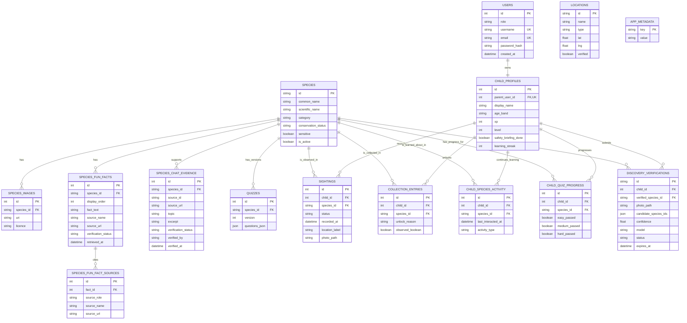

# RimbaQuest — Iteration 2 Entity-Relationship Diagram

This ERD represents the implemented relational schema in `backend/app/core/schema.py`.
It covers the Iteration 1 catalogue and discovery foundation plus the Iteration 2
verification, learning, fun-fact, and chatbot-evidence additions.

## Iteration 2 additions

| Entity | Purpose |
|---|---|
| `discovery_verifications` | Stores the server-owned AI verification result, candidate IDs, confidence, expiry, and completion state before a discovery can be saved. |
| `child_quiz_progress` | Stores each child's Easy/Medium/Hard completion state for a species. |
| `child_species_activity` | Deduplicated “Continue Learning” activity per child and species. |
| `species_fun_facts` | Ten ordered, source-linked child-facing facts per species. |
| `species_fun_fact_sources` | Additional citations for a fun-fact record. |
| `species_chat_evidence` | Approved source excerpts used by the current-species chatbot. |

## Important constraints

- `child_profiles.parent_user_id` is unique: one user has at most one child profile.
- `collection_entries`, `child_species_activity`, and `child_quiz_progress` each have a unique `(child_id, species_id)` pair.
- `species_fun_facts` has a unique `(species_id, display_order)` pair, preserving the ten-fact order.
- `quizzes` has a unique `(species_id, version)` pair.
- `species_chat_evidence` has a unique `(species_id, source_id, source_url, topic)` tuple.
- `locations` is intentionally not connected by a foreign key: a sighting stores a privacy-preserving `location_label`, rather than an exact location ID or coordinates.
- `app_metadata` holds seed/version markers and has no foreign-key relationship.
